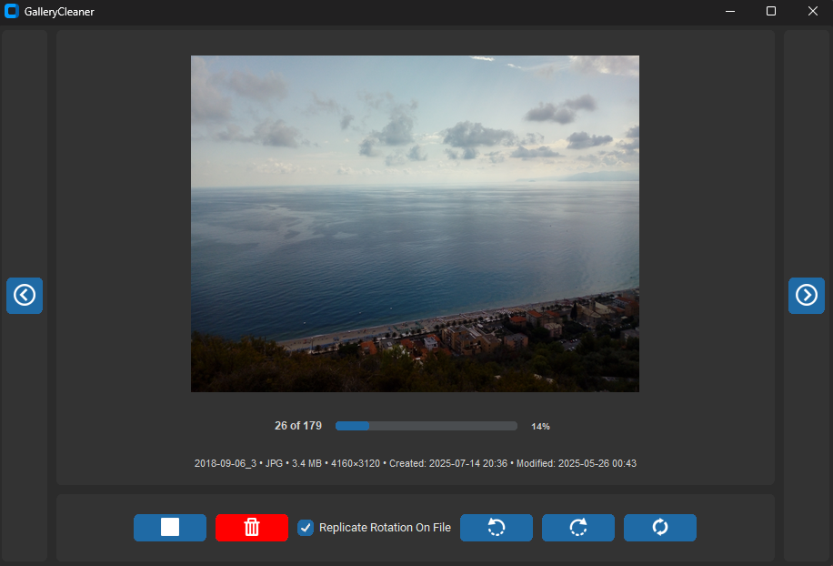

# GalleryCleaner

Lightweight desktop app to review image folders quickly and move unwanted files to your system trash with keyboard-first controls.

## Table of contents

- [Why this project](#why-this-project)
- [Features](#features)
- [Tech stack](#tech-stack)
- [Project structure](#project-structure)
- [Installation](#installation)
- [Usage](#usage)
- [Screenshot](#screenshot)
- [Notes](#notes)
- [Developer](#developer)

## Why this project

Cleaning large photo folders with a normal file manager is slow: too many clicks, too many dialogs, and too much context switching.

GalleryCleaner provides a focused full-screen workflow where you can preview, navigate, rotate, and trash images rapidly from the keyboard.

## Features

- Keyboard-first navigation (`A`/`D` or arrow keys)
- One-key trash action (`S` or down arrow)
- Safe deletion via system trash (`send2trash`)
- Image rotation controls (visual preview + file rotation)
- Recursive directory scan option
- Refresh and back shortcuts for fast iteration
- Modern UI built with CustomTkinter

## Tech stack

- Python 3.7+
- CustomTkinter
- Pillow
- Send2Trash

## Project structure

```text
.
├─ src/
│  └─ main.py                  # Main desktop application
├─ scripts/
│  ├─ setup.bat                # Windows setup script
│  ├─ setup.sh                 # Unix setup script
│  ├─ run.bat                  # Windows run script
│  └─ run.sh                   # Unix run script
├─ resources/
│  └─ images/                  # Application icons
├─ docs/
│  └─ images/
│     └─ screenshot.png        # UI screenshot
├─ requirements.txt            # Python dependencies
├─ LICENSE
└─ README.md
```

The project follows a clean organizational structure:
- **src/**: Application source code
- **scripts/**: Setup and runtime scripts
- **resources/**: Runtime assets (icons)
- **docs/**: Documentation assets

## Installation

### Prerequisites

- Python 3.7 or newer
- Windows, macOS, or Linux

### Quick start

1. Clone the repository:
   ```bash
   git clone https://github.com/LorenBll/GalleryCleaner.git
   cd GalleryCleaner
   ```

2. Run setup:
   - **Windows:**
     ```bash
     scripts\setup.bat
     ```
   - **macOS/Linux:**
     ```bash
     chmod +x scripts/setup.sh scripts/run.sh
     ./scripts/setup.sh
     ```

3. Run the app:
   - **Windows:**
     ```bash
     scripts\run.bat
     ```
   - **macOS/Linux:**
     ```bash
     ./scripts/run.sh
     ```

The setup script creates `.venv` and installs dependencies from `requirements.txt`.

### Manual execution

1. Create and activate virtual environment:
   ```bash
   python -m venv .venv
   # Windows
   .venv\Scripts\activate
   # macOS/Linux
   source .venv/bin/activate
   ```

2. Install dependencies:
   ```bash
   pip install -r requirements.txt
   ```

3. Start the app:
   ```bash
   python src/main.py
   ```

## Usage

1. Launch the app
2. Enter an image directory path
3. Optionally enable recursive mode
4. Navigate images and trash unwanted ones quickly

### Keyboard shortcuts

- `A` / `Left`: previous image
- `D` / `Right`: next image
- `S` / `Down`: move current image to trash
- `Ctrl+Q`: rotate left
- `Ctrl+E`: rotate right
- `Ctrl+R`: refresh folder
- `Esc` (or `Ctrl+B`): return to folder input
- `Enter`: submit folder on input screen

## Screenshot



## Notes

- Files are moved to trash, not permanently deleted.
- The app is optimized for fast local cleanup sessions.

## Developer

Created by [LorenBll](https://github.com/LorenBll)
